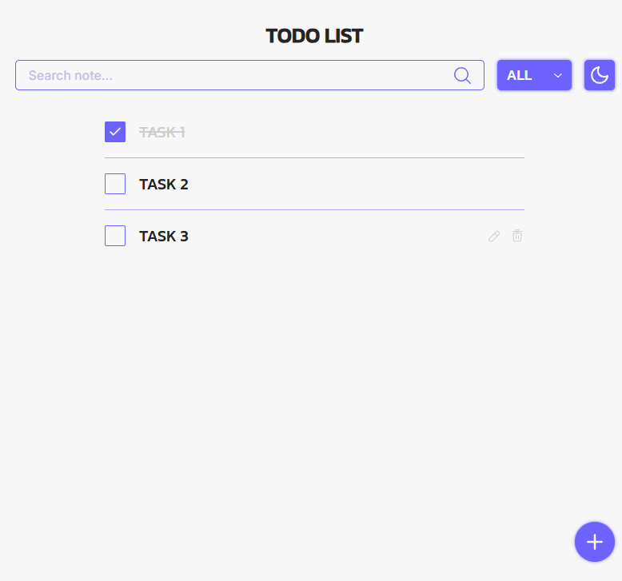

# 📝 To Do List

Приложение "To Do List" на чистом HTML, CSS, JavaScript.

## 🖼️ Дизайн

Дизайн взят из бесплатного макета Figma



🔗 [Ссылка на макет Figma](https://www.figma.com/design/R15u8JyTQQTRvkoloCRgld/Simple-ToDo-List-Design--Community-?t=svuMK94xz9EytTtv-0)

## ⚙️ Возможности

- ✔️ Добавление новой задачи
- ✔️ Редактирование существующей задачи
- ✔️ Удаление задачи
- ✔️ Отметка задачи как выполненной
- ✔️ Поиск по названию задачи
- ✔️ Фильтрация по выполненным и невыполненным задачам
- ✔️ Смена темы
- ✔️ Сохранение всех данных в `localStorage`
- ✔️ Адаптивная верстка
- ✔️ Кастомный доступный `select` (клавиатурная навигация, aria-атрибуты)

## 🛠️ Технологии

- **HTML5**
- **CSS3**
- **JavaScript (ES6+)**
- **Accessibility**
- **BEM**

## 🚀 Запуск

1. 🔗 [Открыть сайт](https://daniltyrtychnyi.github.io/todo-app/)

2. Клонировать репозиторий:
```bash
git clone git@github.com:daniltyrtychnyi/todo-app.git
```