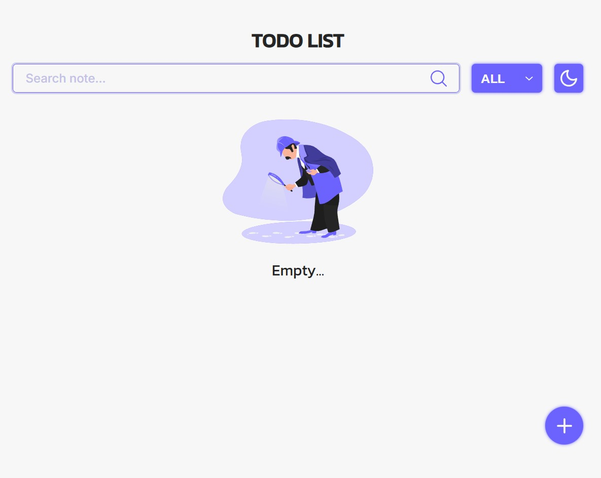

# 📝 To Do List

Приложение "To Do List" на чистом HTML, CSS и JavaScript.

## 🖼️ Дизайн

Дизайн взят из бесплатного макета Figma.



🔗 [Ссылка на макет Figma](https://www.figma.com/design/R15u8JyTQQTRvkoloCRgld/Simple-ToDo-List-Design--Community-?t=svuMK94xz9EytTtv-0)

## ⚙️ Возможности

- ✔️ Добавление новой задачи
- ✔️ Редактирование существующей задачи
- ✔️ Удаление задачи
- ✔️ Отметка задач как выполненных
- ✔️ Поиск по названию задачи
- ✔️ Фильтрация выполненных и невыполненных задач
- ✔️ Переключение светлой и тёмной темы
- ✔️ Определение системной темы пользователя при первом запуске
- ✔️ Сохранение задач и выбранной темы в `localStorage`
- ✔️ Адаптивная верстка
- ✔️ Доступный кастомный `select` с клавиатурной навигацией и ARIA-атрибутами

## 🛠️ Технологии

- **HTML5**
- **CSS3**
- **JavaScript (ES6+)**
- **Accessibility**
- **BEM**

## 🎯 Цель проекта

Создать учебный ToDo-проект, приближенный к реальному веб-приложению, чтобы продемонстрировать навыки работы с JavaScript, DOM, состоянием приложения, localStorage, адаптивной версткой и accessibility.

## 🚀 Запуск

1. 🔗 [Открыть сайт](https://daniltyrtychnyi.github.io/todo-app/)

2. Клонировать репозиторий:

```bash
git clone https://github.com/daniltyrtychnyi/todo-app.git
```

3. Запустить проект через локальный сервер:
    - **Visual Studio Code** — установить
      расширение [Live Server](https://marketplace.visualstudio.com/items?itemName=ritwickdey.LiveServer), правый клик
      на `index.html` → *Open with Live Server*
    - **WebStorm** — запустить проект через встроенный локальный сервер
